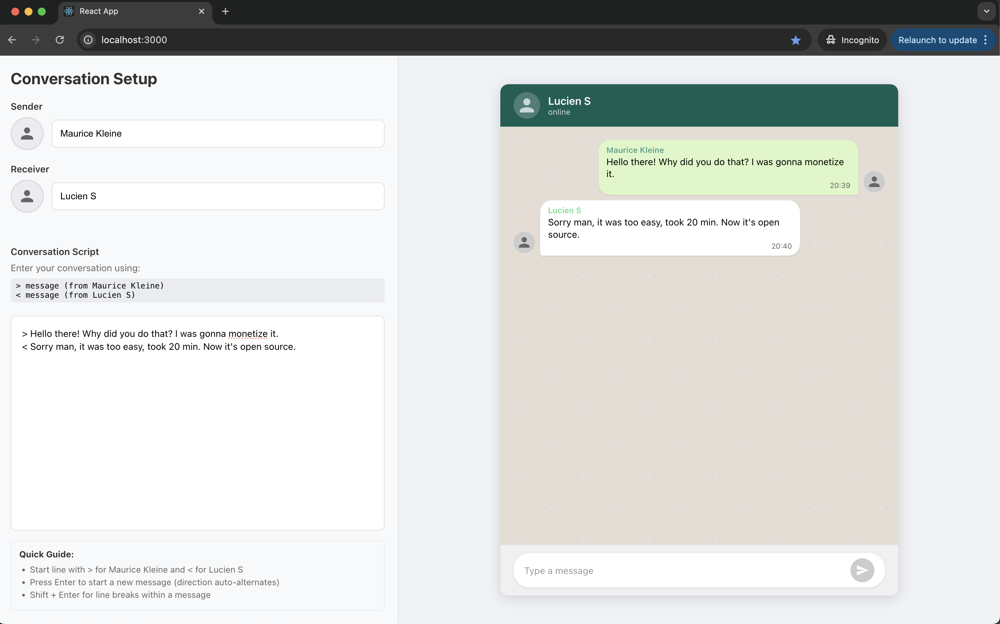

# Mock Conversation Template

A React application for creating mock conversations that look like WhatsApp chats. Perfect for creating conversation mockups, demos, or examples.



## Features

- Split interface with conversation input and WhatsApp-like preview
- Profile photo uploads for participants
- Real-time conversation preview
- Simple `>` and `<` syntax for messages
- Auto-alternating message directions

## How to Run

1. Install dependencies:
   ```bash
   npm install
   ```

2. Start the development server:
   ```bash
   npm start
   ```

3. Open [http://localhost:3000](http://localhost:3000) in your browser

## How to Use

- Use `>` for sender messages and `<` for receiver messages
- Press Enter to start a new message (direction auto-alternates)
- Click on avatar placeholders to upload profile photos
- Type directly in the chat input or use the script area
- Use custom timestamps with `\(HH:MM)` syntax at the end of messages
- Download conversations as images using the download button

## Architecture & Codebase Organization

This React application follows a clean, component-based architecture with TypeScript for type safety. Here's how the codebase is organized:

### Project Structure

```
src/
├── components/          # Reusable UI components
├── constants/          # Application constants and configuration
├── hooks/             # Custom React hooks
├── styles/            # Styled-components definitions
└── utils/             # Utility functions and helpers
```

### Key Components

#### Core Components (`src/components/`)
- **`App.tsx`** - Main application container with split-panel layout
- **`Chat.tsx`** - WhatsApp-like conversation display with message rendering
- **`InputPanel.tsx`** - Left panel containing conversation input and controls
- **`PlatformSelector.tsx`** - Platform theme selection (WhatsApp, etc.)
- **`Settings.tsx`** - Application settings and configuration
- **`DownloadButton.tsx`** - Screenshot/download functionality
- **`FloatingControls.tsx`** - Floating action buttons for mobile view

#### Styling Architecture (`src/styles/`)
- **`GlobalStyles.ts`** - Global styles and CSS resets using styled-components
- **`ChatStyles.ts`** - Chat-specific styled components for message bubbles, layout, etc.

We use **styled-components** throughout for several reasons:
- **Type safety** - Full TypeScript integration
- **Component encapsulation** - Styles are scoped to components
- **Dynamic styling** - Easy to pass props for conditional styling
- **No CSS conflicts** - Automatic class name generation prevents conflicts

#### Utilities (`src/utils/`)
- **`downloadUtils.ts`** - Handles screenshot generation and download functionality using html2canvas

#### Configuration (`src/constants/`)
- **`platforms.ts`** - Platform-specific theming and configuration

#### Custom Hooks (`src/hooks/`)
- **`useTheme.tsx`** - Theme management and switching logic

### Design Decisions & Patterns

#### 1. **TypeScript First**
- All components are written in TypeScript for better developer experience
- Proper interfaces and types for all props and state
- Helps catch errors early and provides better IDE support

#### 2. **Styled-Components Architecture**
- Each major component has its styled components in the same file
- Global styles are centralized in `GlobalStyles.ts`
- Chat-specific styles are in `ChatStyles.ts` for reusability
- Use descriptive component names (e.g., `MessageBubble`, `ChatContainer`)

#### 3. **Component Composition**
- Small, focused components with single responsibilities
- Props interfaces clearly defined for each component
- Reusable components are kept generic and configurable

#### 4. **Layout Strategy**
- **Split-panel layout** - Left panel for input, right panel for preview
- **Flex-based layouts** - Prevents scrolling issues and ensures proper sizing
- **Mobile-first responsive design** - Scales from mobile to desktop
- **Aspect ratio preservation** - Mobile view maintains authentic phone proportions

#### 5. **State Management**
- Local component state for UI interactions
- Props drilling for shared state (simple enough for current scope)
- Custom hooks for complex logic (theme management)

#### 6. **File Organization Principles**
- **Feature-based grouping** - Related functionality stays together
- **Clear naming conventions** - Component names match file names
- **Separation of concerns** - Styles, logic, and components are separated
- **Index files avoided** - Direct imports for better clarity

### Development Guidelines

#### When Adding New Features:
1. **Components** - Create new components in `src/components/`
2. **Styling** - Use styled-components, follow existing patterns
3. **Types** - Always define TypeScript interfaces for props
4. **Utilities** - Pure functions go in `src/utils/`
5. **Constants** - Configuration values go in `src/constants/`

#### Styling Guidelines:
- Use styled-components for all styling
- Follow the existing naming pattern for styled components
- Keep styles close to the components that use them
- Use TypeScript interfaces for styled component props
- Prefer composition over inheritance for styling

#### Code Style:
- Use functional components with hooks
- Prefer const assertions for immutable data
- Use descriptive variable and function names
- Keep components small and focused
- Extract complex logic into custom hooks

### Key Features Implementation

#### Custom Timestamps
- Parsing logic in message processing
- Syntax: `\(HH:MM)` at end of messages
- Persistent until next custom time specified

#### Download Functionality
- Uses html2canvas for screenshot generation
- Handles both desktop and mobile views
- Custom onclone callback for proper rendering
- Resolves styling issues with placeholder text

#### Mobile View
- Custom iPhone 14 dimensions (390px × 844px)
- Proper aspect ratio maintenance
- Rounded corners for authentic appearance
- Responsive scaling for different screen sizes

This architecture ensures the codebase remains maintainable, scalable, and easy to understand for new contributors.

## Contributing

Please feel free to contribute to the project! We welcome improvements, bug fixes, new features, and other enhancements.

When making a pull request, please make sure to explain what you are adding or improving. This helps us understand your changes and review them more effectively.

## License

This project is licensed under the GNU General Public License v3.0 - see the [LICENSE](LICENSE) file for details.

## GNU General Public License

This program is free software: you can redistribute it and/or modify it under the terms of the GNU General Public License as published by the Free Software Foundation, either version 3 of the License, or (at your option) any later version.

This program is distributed in the hope that it will be useful, but WITHOUT ANY WARRANTY; without even the implied warranty of MERCHANTABILITY or FITNESS FOR A PARTICULAR PURPOSE. See the GNU General Public License for more details.

You should have received a copy of the GNU General Public License along with this program. If not, see <https://www.gnu.org/licenses/>.

